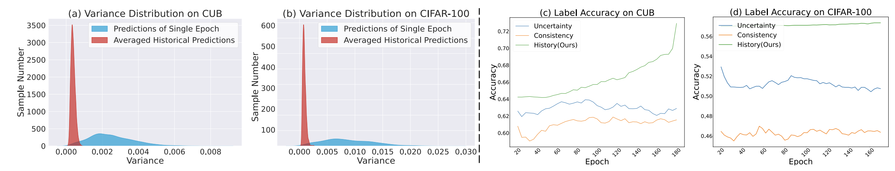
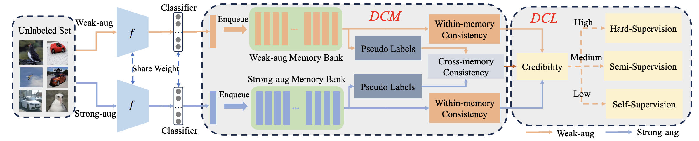

# Memory Consistency Guided Divide-and-Conquer Learning for Generalized Category Discovery


<p align="center">
    <a href="https://arxiv.org/pdf/2401.13325v1"></a>
  <a href="https://github.com/CVMI-Lab/SlotCon/blob/master/LICENSE"></a>
</p>
<p align="center">
	Memory Consistency Guided Divide-and-Conquer Learning for Generalized Category Discovery<br>
  By
  <a>Yuanpeng Tu</a>, 
  <a>Zhun Zhong</a>, 
  <a>Yuxi Li</a>, and 
  <a>Hengshuang Zhao</a>.
</p>





Generalized category discovery (GCD) aims at addressing a more realistic and challenging setting of semi-supervised learning, where only part of the category labels are assigned to certain training samples. Previous methods generally employ naive contrastive learning or unsupervised clustering scheme for all the samples. Nevertheless, they usually ignore the inherent critical information within the historical predictions of the model being trained. Specifically, we empirically reveal that a significant number of salient unlabeled samples yield consistent historical predictions corresponding to their ground truth category. From this observation, we propose a Memory Consistency guided Divide-and-conquer Learning framework (MCDL). In this framework, we introduce two memory banks to record historical prediction of unlabeled data, which are exploited to measure the credibility of each sample in terms of its prediction consistency. With the guidance of credibility, we can design a divide-and-conquer learning strategy to fully utilize the discriminative information of unlabeled data while alleviating the negative influence of noisy labels. Extensive experimental results on multiple benchmarks demonstrate the generality and superiority of our method, where our method outperforms state-of-the-art models by a large margin on both seen and unseen classes of the generic image recognition and challenging semantic shift settings (i.e., with +8.4% gain on CUB and +8.1% on Standford Cars).

## Running

### Dependencies

```
pip install -r requirements.txt
```

### Config

Set paths to datasets and desired log directories in ```config.py```


### Datasets

We use fine-grained benchmarks in this paper, including:

* [The Semantic Shift Benchmark (SSB)](https://github.com/sgvaze/osr_closed_set_all_you_need#ssb) and [Herbarium19](https://www.kaggle.com/c/herbarium-2019-fgvc6)

We also use generic object recognition datasets, including:

* [CIFAR-10/100](https://pytorch.org/vision/stable/datasets.html) and [ImageNet-100/1K](https://image-net.org/download.php)


### Scripts

**Train the model**:

```
bash scripts/run_${DATASET_NAME}.sh
```

## Citing this work

If you find this repo useful for your research, please consider citing our paper:

```
@misc{tu2024memoryconsistencyguideddivideandconquer,
      title={Memory Consistency Guided Divide-and-Conquer Learning for Generalized Category Discovery}, 
      author={Yuanpeng Tu and Zhun Zhong and Yuxi Li and Hengshuang Zhao},
      year={2024},
      eprint={2401.13325},
}
```

## Acknowledgements

The codebase is largely built on this repo: https://github.com/CVMI-Lab/SimGCD.

## License

This project is licensed under the MIT License - see the [LICENSE](LICENSE) file for details.